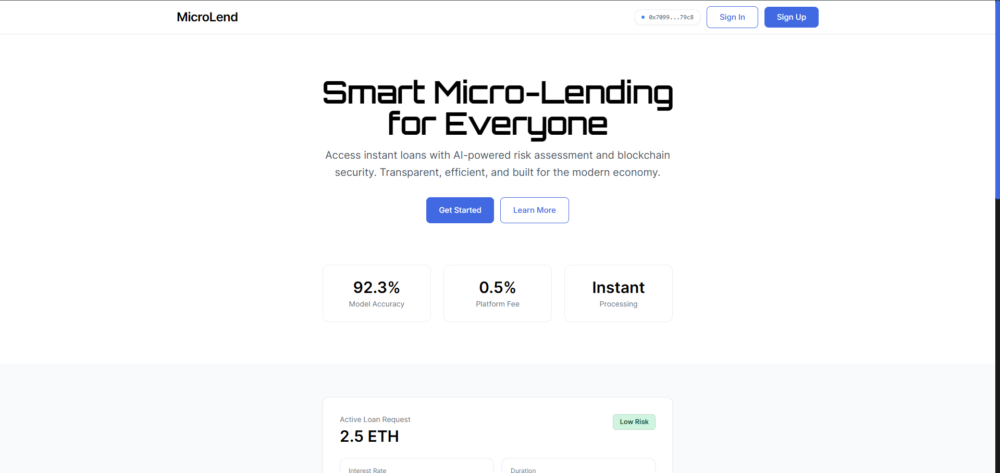
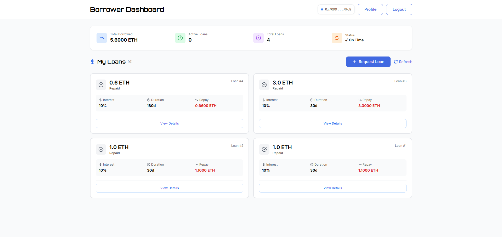
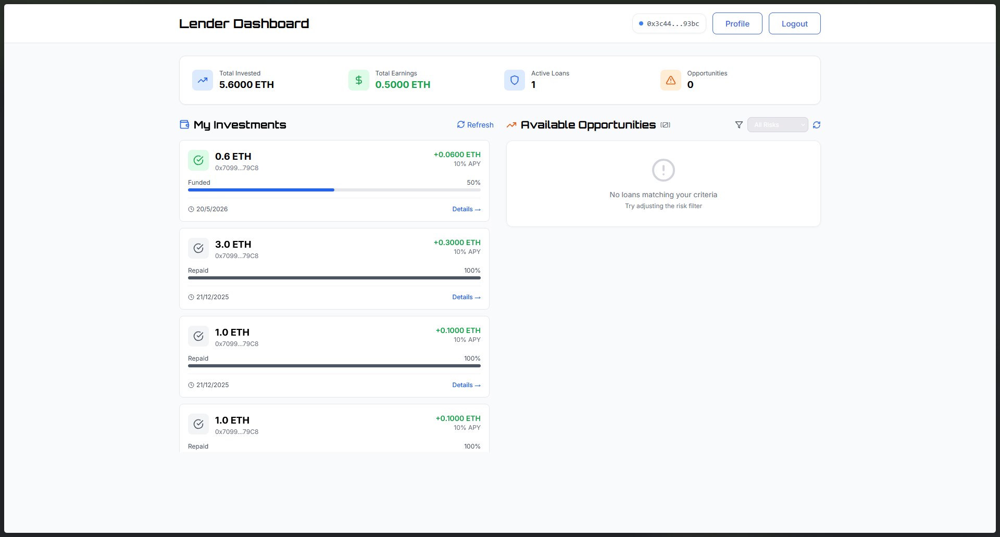
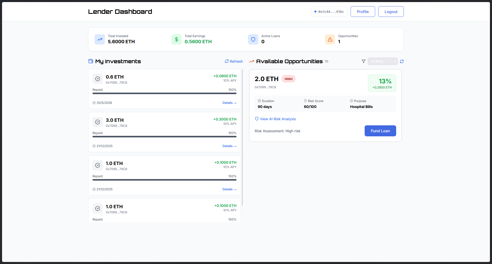
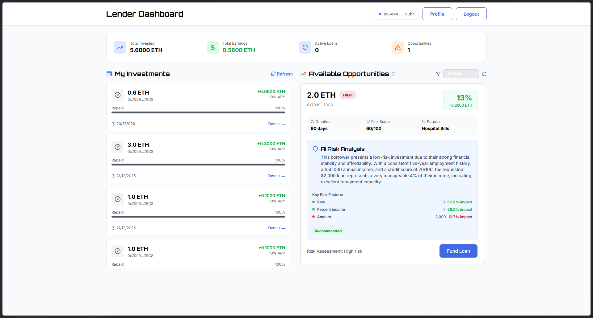
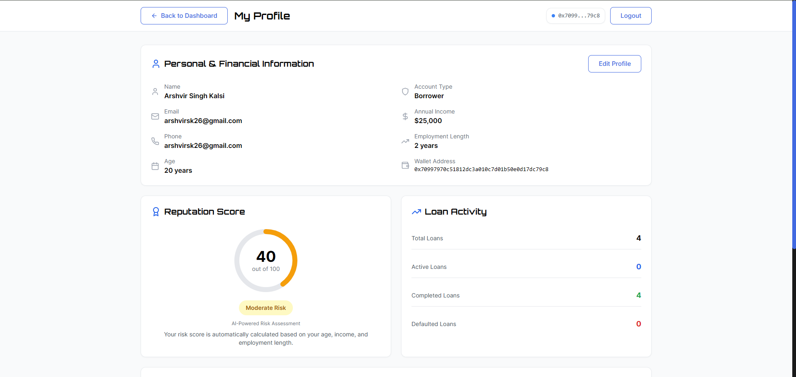
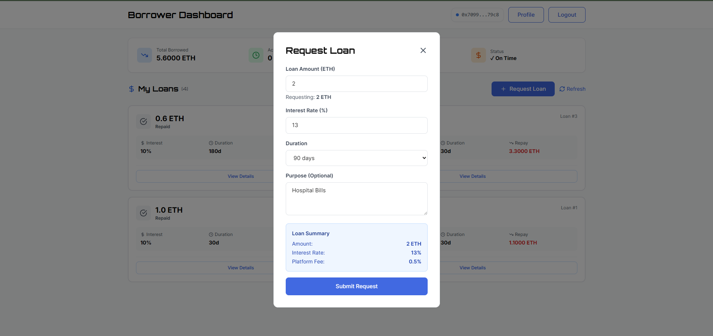
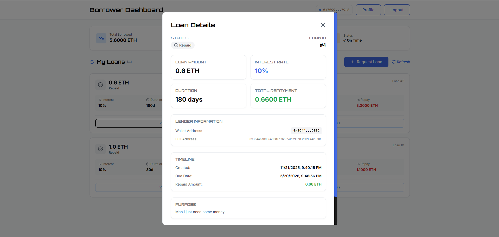

# 🏦 MicroLend - Decentralized Micro-Lending Platform

A complete full-stack decentralized micro-lending platform combining blockchain technology, AI-powered risk assessment, and modern web technologies. Built for **HackWithStack Hackathon** by Team MicroLend.

## 🌟 Overview

MicroLend is a peer-to-peer lending platform that enables borrowers to request loans and lenders to fund them through Ethereum smart contracts. The platform features AI-driven risk assessment, explainable AI insights, user authentication, and a modern responsive interface.

## ✨ Features

### 🔗 Blockchain Features

- 💰 **Loan Requests** - Create loan requests with custom amount, interest rate, duration, and purpose
- 🤝 **Loan Funding** - Lenders can fund loans directly through smart contracts
- 💸 **Loan Repayment** - Automatic interest calculation and repayment tracking
- 📊 **Risk Scoring** - ML-powered risk assessment (0-100 scale)
- ⭐ **Reputation System** - On-chain reputation tracking for borrowers
- 🛡️ **Security** - ReentrancyGuard, Ownable pattern, comprehensive input validation
- 📢 **Event Emissions** - Complete transparency with blockchain events
- 💼 **Escrow System** - Secure fund holding in smart contract

### 🤖 AI & ML Features

- 🧠 **Machine Learning Risk Assessment** - LightGBM model for credit scoring
- 🔍 **Explainable AI** - SHAP (SHapley Additive exPlanations) for feature importance
- 🗣️ **Natural Language Explanations** - Gemini AI generates human-readable risk assessments
- 📊 **Feature Importance** - Shows which factors (income, age, employment) impact risk most
- 🎯 **Auto Risk Calculation** - Automatic risk score generation during borrower signup
- 💡 **AI Insights** - Lenders see detailed AI explanations for each loan opportunity

### 🔐 Authentication & User Management

- 👤 **User Registration** - Secure signup with user type selection (borrower/lender)
- 🔑 **JWT Authentication** - Token-based authentication with 7-day expiration
- 📝 **User Profiles** - Editable profiles with financial information
- 🔒 **Password Hashing** - Secure password storage with Werkzeug
- 💾 **MongoDB Storage** - User data and financial profiles stored in MongoDB Atlas
- 🔄 **Session Persistence** - Remember me functionality with localStorage

### 🎨 Frontend Features

- 📱 **Responsive Design** - Works seamlessly on desktop, tablet, and mobile
- 🎯 **Role-Based Dashboards** - Separate interfaces for borrowers and lenders
- 📊 **Real-Time Stats** - Live portfolio metrics and loan statistics
- 🔄 **Auto-Refresh** - Real-time updates from blockchain
- 🎨 **Modern UI** - Clean, intuitive interface with TailwindCSS
- ⚡ **Fast Performance** - Built with Vite for optimal speed
- 🌈 **Color-Coded Status** - Visual indicators for loan states and risk levels
- 📋 **Two-Column Layout** - Enhanced visibility for investments and opportunities (lender)
- 📑 **Two-Column Grid** - Organized loan cards for better overview (borrower)

## 📸 Application Screenshots

### Landing Page

The homepage welcomes users with a clean interface and easy access to sign up or log in.



### Borrower Dashboard

Borrowers can view all their loans, track repayment status, and manage their loan requests.



### Lender Dashboard - Investments

Lenders can track their active investments, earnings, and portfolio performance in the left column.



### Lender Dashboard - Opportunities

The right column shows available loan opportunities with risk scores and potential earnings.



### AI Analytics Feature

Explainable AI provides detailed risk analysis showing which factors impact the borrower's credit score.



### Profile Management

Users can update their financial information, which is used for risk assessment calculations.



### Loan Request Form

Borrowers can create new loan requests with custom terms including amount, interest rate, and duration.



### Loan Details Modal

Detailed view of loan information including terms, repayment schedule, and current status.



## 🛠️ Tech Stack

### Frontend

- **React 18** - Modern UI library
- **Vite** - Lightning-fast build tool
- **TailwindCSS** - Utility-first styling
- **Ethers.js v6** - Ethereum interaction
- **React Router** - Client-side routing
- **Lucide React** - Beautiful icons

### Backend

- **Flask** - Python web framework
- **PyMongo** - MongoDB driver
- **Flask-CORS** - Cross-origin support
- **JWT** - Token authentication
- **Werkzeug** - Password hashing

### Machine Learning

- **LightGBM** - Gradient boosting model
- **SHAP** - Explainable AI library
- **Scikit-learn** - Data preprocessing
- **NumPy** - Numerical computing
- **Google Gemini AI** - Natural language generation

### Blockchain

- **Hardhat 3.x** - Development environment
- **Solidity ^0.8.20** - Smart contract language
- **OpenZeppelin** - Security contracts
- **Ethers.js** - Blockchain interaction

### Database

- **MongoDB Atlas** - Cloud database

## 📋 Prerequisites

Before you begin, ensure you have the following installed:

- **Node.js** (v16 or higher) & npm
- **Python 3.x** (3.8 or higher)
- **Git** - Version control
- **MetaMask** - Browser extension for Ethereum wallet
- **MongoDB Atlas Account** - Free tier is sufficient

## 🚀 Complete Setup Guide

### Step 1: Clone the Repository

```bash
git clone https://github.com/aayushhh-operator/HackWithStack_LogicLooms.git
cd HackWithStack_LogicLooms-contracts
```

### Step 2: Backend Setup

#### 2.1 Install Python Dependencies

```bash
cd backend
pip install -r requirements.txt
```

#### 2.2 Configure Environment Variables

The `.env` file should already exist in the `backend/` folder with:

```env
MONGODB_URI=your_mongodb_connection_string
SECRET_KEY=your_jwt_secret_key
GEMINI_API_KEY=your_gemini_api_key  # Optional, for AI explanations
```

**Important:**

- Replace `your_mongodb_connection_string` with your MongoDB Atlas connection string
- Change `your_jwt_secret_key` to a secure random string
- Get Gemini API key from [Google AI Studio](https://aistudio.google.com/app/apikey) (optional)

#### 2.3 Verify ML Model

Ensure `risk_model (1).pkl` exists in the `backend/` folder. This is the trained LightGBM model.

### Step 3: Smart Contract Setup

#### 3.1 Install Contract Dependencies

```bash
cd ../contracts
npm install
```

#### 3.2 Compile Contracts

```bash
npx hardhat compile
```

### Step 4: Frontend Setup

#### 4.1 Install Frontend Dependencies

```bash
cd ../frontend
npm install
```

### Step 5: MetaMask Configuration

1. **Install MetaMask** browser extension if not already installed
2. **Create or import a wallet**
3. **Add Hardhat Local Network:**
   - Open MetaMask → Settings → Networks → Add Network
   - **Network Name:** `Hardhat Local`
   - **RPC URL:** `http://127.0.0.1:8545`
   - **Chain ID:** `1337`
   - **Currency Symbol:** `ETH`

## 🎬 Starting the Application

You need to run **4 separate terminal windows** simultaneously:

### Terminal 1: Start Hardhat Blockchain Node

```bash
cd contracts
npx hardhat node
```

**What this does:**

- Starts local Ethereum blockchain on port 8545
- Provides 20 test accounts with 10,000 ETH each
- Keep this running - don't close the terminal

**Copy one of the private keys shown** - you'll need it for MetaMask.

### Terminal 2: Deploy Smart Contract

**Wait for Terminal 1 to be fully running**, then in a new terminal:

```bash
cd contracts
npx hardhat ignition deploy ignition/modules/MicroLending.js --network localhost
```

**What this does:**

- Deploys MicroLending contract to local blockchain
- Shows contract address (save this)
- Creates `deploymentInfo.json` with contract details

**Note:** If you restart the Hardhat node (Terminal 1), you must re-deploy the contract.

### Terminal 3: Start Backend Server

```bash
cd backend
python app.py
```

**What this does:**

- Starts Flask server on port 5000
- Loads ML model and SHAP explainer
- Configures Gemini AI (if API key provided)
- Connects to MongoDB

**You should see:**

```
✓ ML Model loaded successfully
✓ SHAP Explainer configured
✓ Gemini AI configured (or warning if no API key)
* Running on http://127.0.0.1:5000
```

### Terminal 4: Start Frontend Development Server

```bash
cd frontend
npm run dev
```

**What this does:**

- Starts Vite dev server on port 5173
- Enables hot module replacement
- Provides local and network URLs

**You should see:**

```
VITE v5.x.x  ready in xxx ms
➜  Local:   http://localhost:5173/
➜  Network: http://192.168.x.x:5173/
```

## 🎮 Using the Application

### 1. Import Test Account to MetaMask

1. Open MetaMask
2. Click account icon → Import Account
3. Paste a private key from Terminal 1 (Hardhat node output)
4. Switch to **Hardhat Local** network

### 2. Create Your Account

1. Navigate to `http://localhost:5173`
2. Click **"Get Started"** or **"Sign Up"**
3. Fill in registration form:
   - Name, Email, Password, Phone
   - **Age** (used for risk calculation)
   - **Annual Income** (in USD)
   - **Employment Length** (in years)
   - Select user type: **Borrower** or **Lender**
4. Click **"Sign Up"**
5. Risk score is automatically calculated on signup

### 3. Login

1. Use your email and password
2. Check **"Remember me"** to save email
3. Click **"Login"**

### 4. Connect Wallet

1. On Dashboard, click **"Connect Wallet"**
2. MetaMask will pop up
3. Select your imported account
4. Click **"Connect"**

### 5. As a Borrower

#### Request a Loan

1. Click **"Request Loan"** button
2. Fill in loan details:
   - **Amount** (in ETH, e.g., 0.5)
   - **Interest Rate** (%, e.g., 10)
   - **Duration** (days, e.g., 30)
   - **Purpose** (optional description)
3. Click **"Submit Request"**
4. Confirm transaction in MetaMask
5. Wait for transaction confirmation

#### View Your Loans

- **My Loans** section shows all your loan requests
- Status indicators:
  - 🟡 **Pending** - Waiting for lender
  - 🟢 **Funded** - Money received, needs repayment
  - ⚪ **Repaid** - Fully paid back

#### Repay a Loan

1. Find a **Funded** loan
2. Click **"Repay Now"**
3. Confirm repayment amount (principal + interest)
4. Approve transaction in MetaMask

### 6. As a Lender

#### View Opportunities

- **Available Opportunities** section lists all pending loans
- Each opportunity shows:
  - Loan amount and interest rate
  - Borrower's risk score
  - Expected return
  - Duration and purpose

#### Get AI Insights

1. Find a loan opportunity
2. Click **"View AI Risk Analysis"**
3. Review:
   - **AI Explanation** - Natural language assessment
   - **Key Risk Factors** - Top 3 factors with impacts
   - **Feature Importance** - Which borrower attributes matter most
   - **Recommendation** - AI-based investment suggestion

#### Fund a Loan

1. Review loan details and AI insights
2. Click **"Fund Loan"**
3. Confirm amount in MetaMask
4. Approve transaction
5. Loan moves to your **My Investments** section

#### Monitor Investments

- **My Investments** (left column) shows funded loans
- Track progress bars
- View expected returns
- Monitor due dates

### 7. Profile Management

1. Click **"Profile"** in navigation
2. Update financial information:
   - Age
   - Annual Income
   - Employment Length
3. Changes affect risk score
4. Click **"Save Changes"**

## 📊 Understanding Risk Scores

### Risk Score Range

- **0-29:** 🟢 Low Risk - Highly recommended
- **30-59:** 🟡 Medium Risk - Moderate caution
- **60-100:** 🔴 High Risk - Careful consideration needed

### Risk Factors

The ML model considers 7 key features:

1. **Age** - Older borrowers typically lower risk
2. **Income** - Higher income = better repayment capacity
3. **Employment Length** - Longer employment = stability
4. **Loan Amount** - Higher amounts = higher risk
5. **Interest Rate** - Market signal of risk
6. **Percent of Income** - Loan amount as % of income
7. **Credit History Length** - Calculated as (Age - 18)

### AI Explanations

- **SHAP Values** show feature importance
- **Positive impact** (🟢) - Factor decreases risk
- **Negative impact** (🔴) - Factor increases risk
- **Impact %** - Relative importance of each factor

## 🏗️ Architecture

```
┌─────────────────────────────────────────────────────────┐
│                    User (Browser)                        │
│              MetaMask + React Frontend                   │
└─────────────────────────────────────────────────────────┘
                         │
        ┌────────────────┼────────────────┐
        │                │                │
        ▼                ▼                ▼
┌──────────────┐  ┌──────────────┐  ┌──────────────┐
│  Flask API   │  │   Ethers.js  │  │  Hardhat     │
│  (Port 5000) │  │   Web3       │  │  Node        │
│              │  │   Context    │  │  (Port 8545) │
└──────────────┘  └──────────────┘  └──────────────┘
        │                                    │
        ▼                                    ▼
┌──────────────┐                   ┌──────────────┐
│   MongoDB    │                   │ MicroLending │
│   Atlas      │                   │ Smart        │
│   (Users)    │                   │ Contract     │
└──────────────┘                   └──────────────┘
        │
        ▼
┌──────────────┐
│   ML Model   │
│  LightGBM    │
│  + SHAP      │
└──────────────┘
```

### Data Flow

1. **User Authentication**: Frontend → Flask API → MongoDB
2. **Loan Operations**: Frontend → Ethers.js → MetaMask → Smart Contract
3. **Risk Assessment**: Flask API → ML Model → SHAP → Gemini AI
4. **Real-time Updates**: Smart Contract Events → Frontend Updates

## 📁 Project Structure

```
MicroLend/
│
├── backend/                          # Flask Backend
│   ├── app.py                        # Main Flask application
│   ├── requirements.txt              # Python dependencies
│   ├── .env                          # Environment variables
│   └── risk_model (1).pkl            # Trained ML model
│
├── contracts/                        # Smart Contracts
│   ├── contracts/
│   │   ├── MicroLending.sol          # Main lending contract
│   │   └── Counter.sol               # Example contract
│   ├── ignition/
│   │   └── modules/
│   │       └── MicroLending.js       # Deployment module
│   ├── test/
│   │   └── MicroLending.test.js      # Contract tests
│   ├── hardhat.config.js             # Hardhat configuration
│   ├── deploymentInfo.json           # Deployed contract info
│   └── package.json                  # Node dependencies
│
├── frontend/                         # React Frontend
│   ├── src/
│   │   ├── components/               # Reusable components
│   │   ├── contexts/
│   │   │   ├── AuthContext.jsx       # Authentication state
│   │   │   └── Web3Context.jsx       # Blockchain state
│   │   ├── hooks/
│   │   │   └── useLoan.jsx          # Loan operations hook
│   │   ├── pages/
│   │   │   ├── LandingPage.jsx      # Homepage
│   │   │   ├── Login.jsx            # Login page
│   │   │   ├── Signup.jsx           # Registration page
│   │   │   ├── Profile.jsx          # User profile
│   │   │   ├── BorrowerDashboard.jsx # Borrower interface
│   │   │   └── LenderDashboard.jsx  # Lender interface
│   │   ├── App.jsx                  # Main app component
│   │   └── index.css                # Global styles
│   ├── package.json                 # Frontend dependencies
│   └── vite.config.js               # Vite configuration
│
├── MDs/                             # Documentation
│   ├── EXPLAINABLE_AI_COMPLETE.md   # AI features guide
│   ├── LAYOUT_ENHANCEMENT.md        # UI improvements
│   ├── METAMASK_GUIDE.md            # Wallet setup
│   └── QUICK_REFERENCE.md           # Quick commands
│
└── README.md                        # This file
```

## 🧪 Testing

### Smart Contract Tests

```bash
cd contracts
npx hardhat test
```

Tests include:

- Loan request creation
- Loan funding
- Loan repayment
- Risk score calculation
- Access control
- Edge cases

### Manual Testing Checklist

- [ ] User registration (borrower & lender)
- [ ] Login with remember me
- [ ] Profile updates
- [ ] MetaMask connection
- [ ] Loan request creation
- [ ] Loan funding
- [ ] Loan repayment
- [ ] AI risk explanations
- [ ] Dashboard statistics
- [ ] Real-time updates
- [ ] Responsive design (mobile/tablet/desktop)

## 🐛 Troubleshooting

### Common Issues

#### 1. MetaMask Connection Failed

**Problem:** Can't connect wallet

**Solutions:**

- Ensure MetaMask is installed
- Check you're on Hardhat Local network (Chain ID 1337)
- Refresh page and try again
- Check browser console for errors

#### 2. Transaction Fails

**Problem:** Transaction reverts or fails

**Solutions:**

- Ensure you have enough ETH for gas
- Check contract is deployed (Terminal 2 output)
- Verify you're on correct network
- Check account has sufficient balance

#### 3. Backend Not Loading

**Problem:** Flask server errors

**Solutions:**

- Check MongoDB connection string in `.env`
- Verify Python dependencies installed: `pip install -r requirements.txt`
- Check ML model file exists: `risk_model (1).pkl`
- Look for port conflicts (port 5000)

#### 4. Frontend Won't Start

**Problem:** Vite dev server errors

**Solutions:**

- Delete `node_modules` and reinstall: `npm install`
- Clear Vite cache: `rm -rf node_modules/.vite`
- Check port 5173 is available
- Verify all dependencies installed

#### 5. AI Explanations Not Working

**Problem:** Risk analysis shows error

**Solutions:**

- Add Gemini API key to `backend/.env`
- SHAP still works without Gemini (shows feature importance only)
- Check backend logs for specific errors
- Verify ML model loaded successfully

#### 6. Contract Not Found

**Problem:** "Contract not deployed" error

**Solutions:**

- Restart Hardhat node (Terminal 1)
- Re-deploy contract (Terminal 2)
- Check `deploymentInfo.json` exists
- Verify contract address in logs

## 📚 Additional Documentation

- **[EXPLAINABLE_AI_COMPLETE.md](./MDs/EXPLAINABLE_AI_COMPLETE.md)** - Complete AI features guide
- **[EXPLAINABLE_AI_SUMMARY.md](./EXPLAINABLE_AI_SUMMARY.md)** - Quick AI overview
- **[LAYOUT_ENHANCEMENT.md](./MDs/LAYOUT_ENHANCEMENT.md)** - UI/UX improvements
- **[METAMASK_GUIDE.md](./MDs/METAMASK_GUIDE.md)** - Detailed wallet setup

## 🔑 Smart Contract Functions

### Public Functions

```solidity
// Request a new loan
requestLoan(uint256 amount, uint256 interestRate, uint256 duration, string purpose)

// Fund an existing loan
fundLoan(uint256 loanId) payable

// Repay a funded loan
repayLoan(uint256 loanId) payable

// Get loan details
getLoan(uint256 loanId) returns (Loan)

// Calculate risk score
calculateRiskScore(address borrower, uint256 amount) returns (uint256)

// Get total number of loans
getTotalLoans() returns (uint256)

// Get all loans for a borrower
getBorrowerLoans(address borrower) returns (uint256[])

// Get all loans for a lender
getLenderLoans(address lender) returns (uint256[])
```

### Loan Statuses

- **0 = Requested** - Loan created, waiting for lender
- **1 = Funded** - Loan funded, awaiting repayment
- **2 = Repaid** - Loan fully repaid
- **3 = Defaulted** - Loan not repaid (future feature)

## 🔒 Security Features

### Smart Contract Security

- ✅ **ReentrancyGuard** - Prevents reentrancy attacks on payable functions
- ✅ **Ownable** - Admin-only functions protected
- ✅ **Input Validation** - All inputs validated before processing
- ✅ **Safe Math** - Overflow protection (Solidity 0.8+)
- ✅ **Access Control** - Only borrower can repay, only lenders can fund
- ✅ **Event Emissions** - Full audit trail on blockchain

### Backend Security

- ✅ **Password Hashing** - Werkzeug secure password hashing
- ✅ **JWT Authentication** - Token-based auth with expiration
- ✅ **CORS Protection** - Configured for frontend origin only
- ✅ **Input Sanitization** - MongoDB injection prevention

### Best Practices

- ⚠️ **Never share private keys**
- ⚠️ **Don't commit `.env` files**
- ⚠️ **Test thoroughly before mainnet**
- ⚠️ **Audit smart contracts professionally**
- ⚠️ **Use hardware wallets for production**

## 🚀 Deployment to Production

### Frontend Deployment (Vercel/Netlify)

1. Build production bundle: `npm run build`
2. Deploy `dist/` folder
3. Update environment variables for production backend URL

### Backend Deployment (Railway/Heroku)

1. Ensure `requirements.txt` is up-to-date
2. Configure environment variables
3. Deploy Flask app
4. Update CORS origins for production frontend

### Smart Contract Deployment (Sepolia Testnet)

1. Get Sepolia ETH from faucet
2. Update `hardhat.config.js` with Sepolia RPC
3. Set `SEPOLIA_PRIVATE_KEY` environment variable
4. Deploy: `npx hardhat ignition deploy --network sepolia ignition/modules/MicroLending.js`

## 📊 Features Roadmap

### Implemented ✅

- User authentication & profiles
- Loan creation, funding, repayment
- ML-powered risk assessment
- Explainable AI with SHAP
- Gemini AI natural language explanations
- Real-time blockchain integration
- Responsive UI with modern design
- MetaMask integration

### Future Enhancements 🔮

- [ ] Collateral-based loans
- [ ] Loan insurance pool
- [ ] Default handling & recovery
- [ ] Multi-currency support
- [ ] Mobile app (React Native)
- [ ] Loan marketplace & secondary market
- [ ] Credit score improvement tracking
- [ ] Automated loan matching
- [ ] Governance token
- [ ] Staking rewards for lenders

## 📝 License

MIT License - See LICENSE file for details

## 👥 Team MicroLend

Built for **HackWithStack Hackathon 2025**

### Contributors

<table>
  <tr>
    <td align="center">
      <a href="https://github.com/aayushhh-operator">
        
        <br />
        <sub><b>@aayushhh-operator</b></sub>
      </a>
      <br />
    </td>
    <td align="center">
      <a href="https://github.com/ArshvirSk">
        
        <br />
        <sub><b>@ArshvirSk</b></sub>
      </a>
      <br />
    </td>
    <td align="center">
      <a href="https://github.com/AgentR04">
        
        <br />
        <sub><b>@AgentR04</b></sub>
      </a>
      <br />
    </td>
    <td align="center">
      <a href="https://github.com/Aagnya-Mistry">
        
        <br />
        <sub><b>@Aagnya-Mistry</b></sub>
      </a>
      <br />
    </td>
    <td align="center">
      <a href="https://github.com/kabir-999">
        
        <br />
        <sub><b>@kabir-999</b></sub>
      </a>
      <br />
    </td>
  </tr>
</table>

---

**⭐ Star this repository if you find it helpful!**

**🐛 Report issues:** [GitHub Issues](https://github.com/aayushhh-operator/HackWithStack_LogicLooms/issues)

**📧 Contact:** [arshvirsk26@gmail.com](mailto:arshvirsk26@gmail.com)

---

_Last Updated: November 21, 2025_
